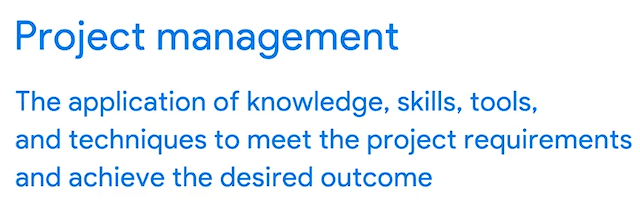
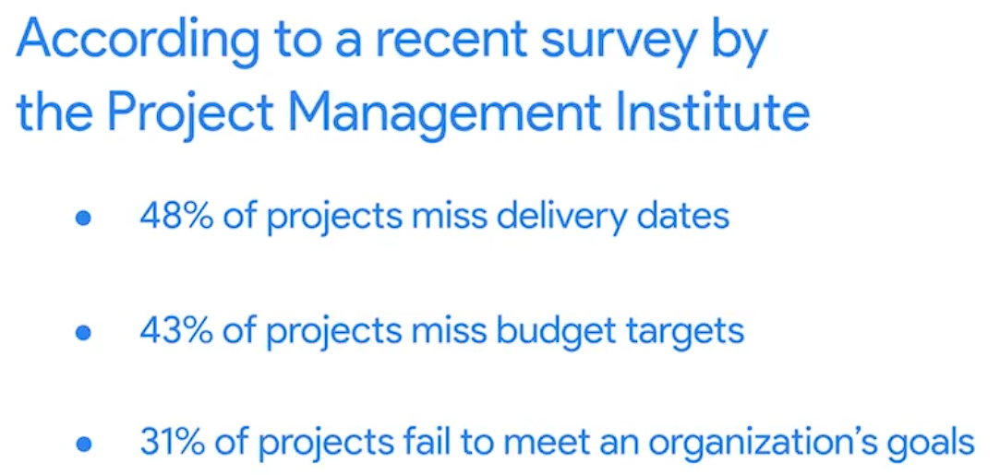

# [Welcome to the Google Project Management Certificate](https://www.coursera.org/learn/project-management-foundations/lecture/t28f8/welcome-to-the-google-project-management-certificate?trk_ref=coach_copy)  Aug 16, 2025

This course provides an introduction to the fundamentals of project management, aimed at helping learners develop essential skills for entry-level project management roles.

**Understanding Project Management**

* Project management involves applying knowledge, skills, tools, and techniques to meet project requirements and achieve desired outcomes.
* Many individuals may already possess project management skills through personal experiences, such as planning events or organizing tasks.

**Course Structure and Content**

* The program consists of six courses covering topics like project management fundamentals, risk management, team dynamics, and various methodologies (Agile, Scrum, Waterfall).
* Learners will engage in hands-on activities, including building project plans, managing budgets, and using project management software.

**Career Preparation and Opportunities**

* The course aims to prepare learners for introductory project management roles, providing opportunities to share work with potential employers.
* Participants will also hear from current Google project managers, gaining insights into the profession and tips for job interviews.

---

# [Program and course overview](https://www.coursera.org/learn/project-management-foundations/supplement/GBPZW/program-and-course-overview?trk_ref=coach_copy)  Aug 16, 2025

This course provides an introduction to the fundamentals of project management, preparing learners for various roles in the field.

Foundations of Project Management

* Learn essential project management terminology and concepts.
* Understand the role and responsibilities of a project manager across different industries.

Project Management Life Cycle

* Explore the phases of the project life cycle and their significance.
* Compare various project management methodologies to determine their effectiveness.

Organizational Impact

* Define organizational structure and culture and their influence on project management.
* Discuss the importance of change management and the project manager's role in the process.

---


# [Introduction to Course 1](https://www.coursera.org/learn/project-management-foundations/lecture/q3E8l/introduction-to-course-1?trk_ref=coach_copy)  Aug 16, 2025

This course provides an overview of project management fundamentals and prepares learners for entry-level roles in the field.

**Understanding Project Management**

* Defines what constitutes a project and the role of a project manager.
* Discusses key project management terms and the responsibilities of an entry-level project manager.

**Skills and Job Opportunities**

* Highlights the core skills necessary for successful project management.
* Explores various job roles available after completing the program, beyond just project manager positions.

**Project Life Cycle and Methodologies**

* Describes the different phases of a project and the tasks associated with each phase.
* Compares various project management methodologies and their effectiveness in different scenarios.

---


# [Get started with your Google Project Management Certificate](https://www.coursera.org/learn/project-management-foundations/lecture/1YqZr/get-started-with-your-google-project-management-certificate?trk_ref=coach_copy)  Aug 16, 2025

The course content focuses on the Google Project Management Certificate, designed to equip learners with essential project management skills.

Overview of the Program

* Created by Google experts to prepare learners for entry-level project management roles.
* Graduates receive an industry-recognized credential and access to resources for job searching.

Support and Resources

* Includes discounts on relevant certifications and one-on-one career coaching for U.S. learners.
* Offers a course on using AI to enhance job search strategies, including resume updates and interview practice.

Tips for Success

* Stay on top of deadlines to increase completion likelihood.
* Engage with the Learner Community for support and advice.
* Maintain persistence in overcoming challenges during the learning process.

---


# [Helpful resources to get started](https://www.coursera.org/learn/project-management-foundations/supplement/qaLq3/helpful-resources-to-get-started?trk_ref=coach_copy)  Aug 16, 2025

The content provides an overview of the Google Project Management Certificate program, focusing on key aspects of the course structure and helpful habits for success.

Course Structure

* Each module includes videos, readings, activities, and quizzes to enhance learning.
* Feedback on course materials can be provided through thumbs-up/down icons and flags for specific issues.

Obtaining the Certificate

* To earn the certificate, learners must pass all graded assignments with a minimum score of 80% and meet one of the payment or sponsorship options.

Helpful Habits for Success

* Plan study time and create a quiet space for focused learning.
* Take notes to reinforce understanding and build connections between topics.
* Engage with other learners and update your Coursera profile to enhance networking opportunities.

---


# [What is project management?](https://www.coursera.org/learn/project-management-foundations/lecture/3wYYw/what-is-project-management?trk_ref=coach_copy)  Aug 16, 2025



This course item content focuses on defining projects and project management, highlighting their significance in organizations.

**What is a Project?**

* A project is a unique, temporary endeavor with a defined beginning and end, aimed at achieving specific deliverables.
* It involves a series of tasks that require collaboration and careful planning to reach the desired outcome.

**What is Project Management?**

* Project management is the application of knowledge, skills, tools, and techniques to meet project requirements and achieve outcomes on time and within budget.
* Effective project management can prevent significant financial losses and ensure projects meet delivery dates and budget targets.

**Real-Life Example and Importance**

* An example is provided where a school district implements telehealth technology, illustrating the need for careful planning, task management, and communication.
* Poor project management can lead to substantial waste, with many projects failing to meet deadlines and organizational goals, emphasizing the critical role of project management in business success.



---


# [What does a project manager do?](https://www.coursera.org/learn/project-management-foundations/lecture/eBWHU/what-does-a-project-manager-do?trk_ref=coach_copy)  Aug 16, 2025

"*In broad terms, a project manager also needs to make sure that the project outcome is bringing value to the company"*

This content focuses on the daily responsibilities and value that project managers bring to organizations.

Project Management Overview

* Project managers are responsible for planning, organizing, managing tasks, budgeting, and controlling costs to ensure projects are completed on time and within budget.
* Their role is to ensure that the project outcomes provide value to the company, whether through new services or improvements to existing ones.

Daily Responsibilities of Project Managers

* Planning and Organizing: This includes gathering requirements from stakeholders and creating project plans to align the team and keep tasks on track.
* Managing Tasks: Project managers oversee team members' tasks and communicate key milestones to keep everyone informed about project progress.

Budgeting and Cost Control

* Managing the budget is crucial, as project plans may change, leading to unexpected costs. Project managers must adapt to these changes to keep the project on track.

---


# [Transferable project management skills](https://www.coursera.org/learn/project-management-foundations/lecture/TQb9o/transferable-project-management-skills?trk_ref=coach_copy)  Aug 16, 2025

The course content focuses on the foundational skills and experiences relevant to project management.

Project Management Skills in Everyday Life

* Planning and organizing skills are essential, as demonstrated through personal experiences like organizing a surprise party or managing employee schedules.
* Budgeting and task management are crucial, whether for personal projects like moving or professional responsibilities.

Translating Skills to Project Management

* Everyday experiences can be leveraged as examples in job interviews to showcase relevant skills such as time management and leadership.
* Recognizing and articulating these skills will help in pursuing a career in project management.

Next Steps in Learning

* The course will further explore various project management roles and job opportunities available after completing the program.

---


# [X: Path to becoming a project manager](https://www.coursera.org/learn/project-management-foundations/lecture/Srixo/x-path-to-becoming-a-project-manager?trk_ref=coach_copy)  Aug 16, 2025

The content focuses on the role of a Program Manager and the skills necessary for effective project management.

Program Management Overview

* Program management is a skill used in everyday life, such as deciding how to allocate time for tasks.
* The speaker shares a non-traditional path to program management, highlighting self-taught coding skills and military experience.

Skills and Responsibilities

* Key skills for a program manager include accountability, collaboration, and effective communication.
* The speaker emphasizes the importance of learning from others and being intentional in applying management skills in both personal and professional contexts.

Personal Passion and Application

* The speaker's passion for bringing people together and resolving conflicts is a driving force in their role.
* Everyday tasks and personal interests can translate into valuable skills for program and project management, with a focus on intentionality and organization.ed version of your reflection with improved grammar and spelling, while keeping your original ideas intact

```plaintext
In my understanding, the main difference between **Project Management** and **Program Management** in the context of an organizational chart in workplaces that Program Management is superior than to Project Management.

For example, in the Software Development Life Cycle (SDLC) for a large project that possibly has five phases, the **Project Manager** is responsible for the planning and execution of a specific phase. They focus on the details of that project to make sure it meets its objectives. They stick to the plan and follow a linear path, especially in crucial phases like development and testing.

On the other hand, the **Program Manager** oversees all the phases, including development, testing, and refinement. They are responsible for managing each division to ensure they are all aligned with the overall end-goal of the entire program.
```

`Improve Ver.`

```

Project Manager
The **person** who leads the team. They are responsible for planning, executing, and closing the project. They focus on leadership, communication, and decision-making to guide the project to success.

Project Management
The **process** and methodology. It is the framework of applying knowledge, skills, tools, and techniques to meet project requirements. It's the "what you do," while the manager is the "who does it."
```

```
the speaker said, they love what job she has as a Program management, because not for run around and telling what to do to everbody , but because he loves to connect the poeple, resolving conflict, getting experience that can apply in real life
```

---


# [From certificate to career success](https://www.coursera.org/learn/project-management-foundations/lecture/d03Fw/from-certificate-to-career-success?trk_ref=coach_copy)  Aug 16, 2025

This course content focuses on the career opportunities available in project management and the skills required to succeed in this field.

Career Opportunities in Project Management

* Project managers are in high demand, with a projected need for 87.7 million roles by 2027 across various industries.
* Specific roles may include titles like "construction project manager" or "IT project manager," but skills are transferable across industries.

Skills and Experience

* Many skills relevant to project management can be found in everyday activities, such as organizing events or managing budgets.
* Internships and contract work are valuable ways to gain experience and build a portfolio, even if the roles are not strictly project management.

Exploring Job Titles and Responsibilities

* Job titles can vary widely, including "operations manager," "project coordinator," and "program assistant," depending on the organization and industry.
* Responsibilities may differ based on the size and type of company, emphasizing the importance of flexibility in job searching.

As you progress through the program, consider the types of roles that interest you and keep track of your preferences to guide your job search.

---


# [Explore project management roles](https://www.coursera.org/learn/project-management-foundations/supplement/fXLY5/explore-project-management-roles?trk_ref=coach_copy)  Aug 16, 2025

This course material outlines the various career paths available in project management and the skills required for each role.

Introductory-level project management roles

* Entry-level positions provide valuable experience in project operations and management.
* Common roles include Junior Project Manager, Project Administrator, and Project Coordinator, each offering different levels of support and responsibility.

Traditional project management roles

* After gaining experience, individuals can advance to roles like Project Manager, Project Analyst, and Project Leader, focusing on project execution and strategy.
* These roles require a mix of planning, monitoring, and closing projects, often in specific industries.

Program and portfolio management roles

* Program Managers oversee multiple related projects, while Portfolio Managers manage a collection of projects and programs across an organization.
* These positions involve strategic decision-making and coordination to ensure alignment with organizational goals.


Project management roles organized by hierarchy:

* **Entry-Level Roles:**
  * Project Support Specialist
  * Project/Program Coordinator
  * Project/Program Assistant
  * Project Administrator
  * Junior Project Manager
* **Traditional Project Management Roles:**
  * Project Manager
  * Project Analyst
  * Project Controller
  * Technical Project Manager
  * Project Leader/Director
  * Project Management Office (PMO) Analyst
* **Program and Portfolio Management Roles:**
  * Program Manager
  * Portfolio Manager
* **Operational Management Roles:**
  * Operations Manager
  * Operations Analyst
  * Chief Operating Officer (COO)
* **Agile Roles:**
  * Scrum Master
  * Product Owner

This hierarchy reflects the progression from entry-level positions to more advanced roles in project management.
