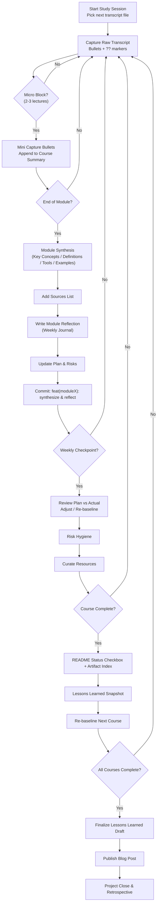

<picture>
	<!-- Dark mode version (add file later) -->
	<source media="(prefers-color-scheme: dark)" srcset="Foundations of Project Management/image/banner/pm-banner-dark.png">
	<!-- Light mode version (add file later) -->
	<source media="(prefers-color-scheme: light)" srcset="Foundations of Project Management/image/banner/pm-banner-light.png">
	
</picture>

<h1>Google Project Management: Professional Certificate</h1>

Structured private knowledge base for capturing raw transcripts, synthesizing course insights, and producing a polished public learning narrative.

<!-- Badges (dynamic placeholders; update targets as progress evolves) -->

	
	
	
	

Get on the fast track to a career in project management. Learn in-demand skills with Google experts and build a PM portfolio. Self-paced; no degree or prior experience required.

## 🎯 Goal

Complete the Google Project Management Professional Certificate and build a project management portfolio.

To successfully complete the Google Project Management Professional Certificate on Coursera by ____. The primary objective is to gain a practical, industry-recognized understanding of project management principles, methodologies, and tools to enhance my resume and qualify for tech internships in ___.

## 📅 Timeline

Start Date: 2025-08-16
Target Finish: YYYY-MM-DD

## 🔗 Quick Links

- Course 1 structured summary: `1_Project_Files/03_Execution/Course_Notes/Course_1_Foundations.md`
- Artifact index: `ARTIFACT_INDEX.md`
- Legacy Course 1 review (superseded): `archive/legacy_notes/course1-learning-objectives-review.md`
- Course log (Foundations – archived): `Foundations of Project Management/progress-log.md`
- Overall progress log: `progress-log.md`
- Transcripts/notes dump: `src/`
- Phased workspace: `1_Project_Files/`

### Resource Snapshot (Centralized)

**Official Link**

- Google Project Management Certificate: https://www.coursera.org/professional-certificates/google-project-management

**Tools & Templates**

- Trello – lightweight kanban: https://trello.com/
- Asana – task & timeline management: https://asana.com/
- Gantt Chart Template (Smartsheet): https://www.smartsheet.com/free-gantt-chart-excel-templates

**Other References**

- PMI (templates & standards): https://www.pmi.org/
- Scrum Guide: https://scrumguides.org/index.html
- Scrum.org Resources: https://www.scrum.org/resources

Governance: Former standalone `resources.md` merged here to reduce fragmentation (avoid maintaining duplicate link lists).

## 📂 Current Folder Structure

- `1_Project_Files/` → Canonical phased workspace (Initiation, Planning, Execution, Closing; course summaries + journal)
- `src/` → Raw transcripts (immutable except typo fixes)
- `archive/legacy_notes/` → Archived legacy summaries (superseded)
- `Foundations of Project Management/` → Images + legacy course-specific progress log
- `progress-log.md` → High-level learning diary (global)
  (Resources previously in `resources.md` now embedded in README Resource Snapshot)

## ✅ Status

- [X] Course 1: Foundations — In progress (Modules 1–2 synthesized)
- [ ] Course 2: Project Initiation
- [ ] Course 3: Project Planning
- [ ] Course 4: Project Execution
- [ ] Course 5: Agile Project Management
- [ ] Course 6: Capstone Project

---

## 🧭 How to use this repo

1. Capture raw intake in `src/` (sequential numbering preserved).
2. Synthesize structured summaries in `1_Project_Files/03_Execution/Course_Notes/` (cite Sources section).
3. Log weekly reflections in `1_Project_Files/03_Execution/Weekly_Project_Journal.md`.
4. Update milestones & risks in `1_Project_Files/02_Planning/` as schedule shifts.
5. Use archived legacy notes only for historical reference (superseded banners indicate replacements).
6. Publish only polished content in the separate portfolio repo (`joembolinas.github.io`).

## 🔄 Learning Workflow Flowchart

The diagram below visualizes the end-to-end cycle from raw capture to publication.

**Caption:** Raw transcripts flow through iterative micro-block consolidation, culminating in structured module synthesis, reflective journaling, plan/risk updates, and periodic checkpoints. Artifacts feed forward to the Lessons Learned draft and final blog publication.
