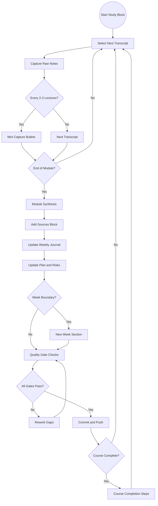
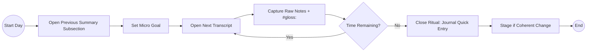
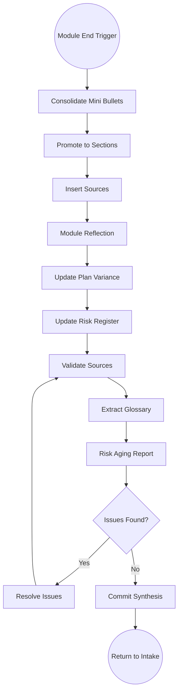
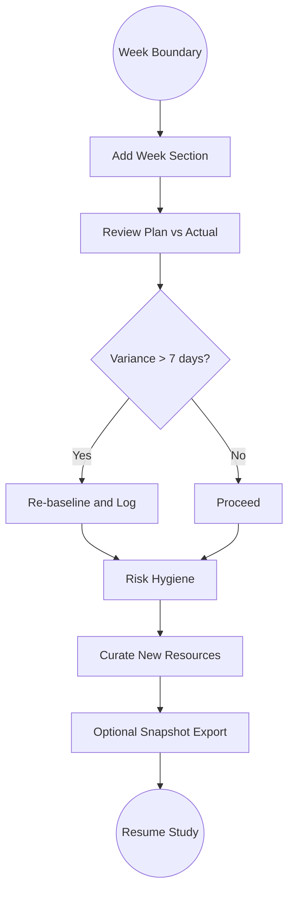
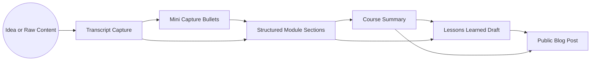
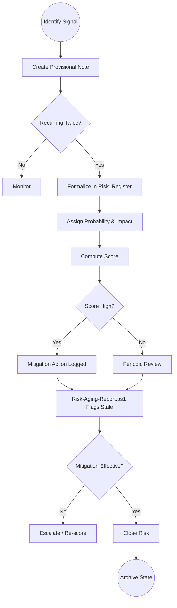
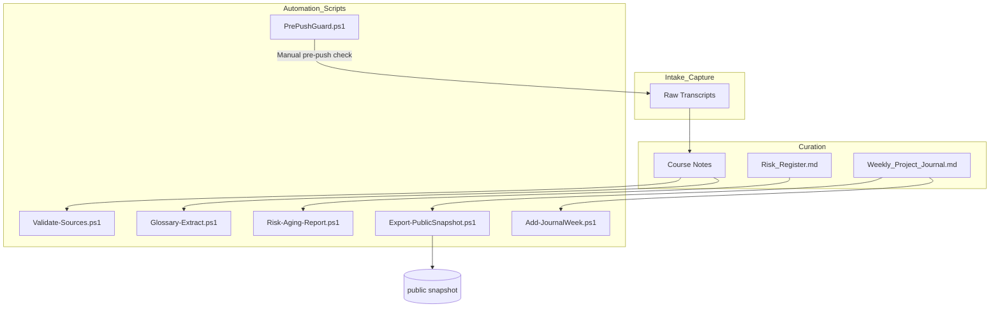

# Workflow Diagrams (Internal Reference)

> Purpose: Visual quick reference of the structured study & curation workflow defined in `setup.md` and forthcoming `workflow.json` (machine-readable spec). These diagrams are for internal process alignment and may be selectively redrawn for any future public blog—do **not** publish raw transcript references.

## Legend
- Circle = Trigger / Start
- Rounded Rectangle = Activity / Ritual
- Diamond = Decision / Gate
- Parallelogram = Artifact (Input/Output)
- Hexagon = Automation Script
- Document Icon (Markdown) = Curated File
- Terminator = End / Stable State

(Shapes implied via labels; Mermaid standard nodes used.)

---

## 1. Overall Study Flow

## 2. Daily Ritual (Focused Micro-Loop)

## 3. Module Lifecycle

## 4. Weekly Checkpoint

## 5. Artifact Promotion Pipeline

## 6. Risk Management Flow

## 7. Automation Scripts Interaction Map

---

## Sources & Alignment
Derived from governance rules in `setup.md`, operational workflow spec (pending `workflow.json`), and previously supplied Mermaid diagrams.

## Maintenance Notes
- Update diagrams if workflow.json structure materially changes.
- Keep this file internal: no direct transcript text; only process abstractions.
- When adding new automation, extend Section 7 instead of altering historic nodes.
